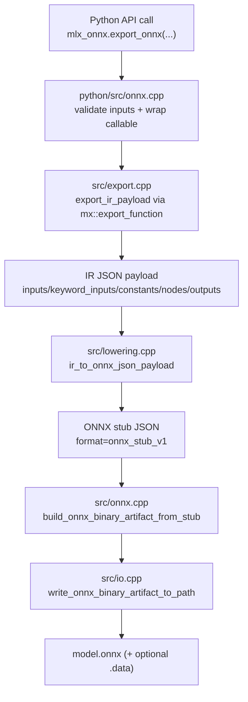
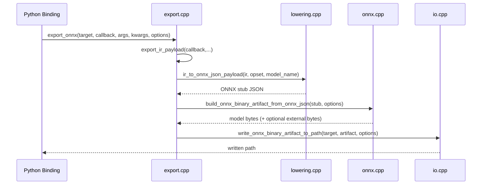

# Native Architecture

This document describes the native `mlx-onnx` architecture: how callbacks are captured, how IR is represented, and how IR is lowered and serialized to ONNX.

## Scope

- Python binding entrypoint and callback bridge
- Native IR capture and JSON payload shape
- IR -> ONNX lowering and rewrite pipeline
- Compatibility-report path
- ONNX binary serialization and file emission
- Error model for unsupported ops/arguments

## Core Components

| Layer | Primary files | Responsibility |
| --- | --- | --- |
| Python binding | `python/src/onnx.cpp` | Validates Python inputs, wraps Python callable into native callback, translates C++ errors to Python exceptions. |
| Public native API | `include/mlx/ir.hpp`, `src/api.cpp`, `src/export.cpp` | Exposes `export_ir*`, `export_onnx*`, `ir_to_onnx*`, compatibility APIs. |
| IR capture | `src/export.cpp` | Uses MLX tracing (`mx::export_function`) to produce Graph IR payload JSON. |
| Lowering engine | `src/lowering.cpp`, `src/mappings.cpp` | Maps/rewrite IR nodes into ONNX stub graph nodes and attributes. |
| Compatibility probe | `src/compat.cpp` | Simulates lowering node-by-node and reports supported/unsupported ops. |
| ONNX binary writer | `src/onnx.cpp`, `src/io.cpp` | Converts ONNX stub JSON to binary protobuf and writes `.onnx` + optional external tensor data. |
| Shared normalization | `src/detail.hpp`, `src/shared.cpp` | Type/shape/value normalization and validation helpers used by lowering/export. |

## End-to-End Flow

## API Call Chains

### `export_onnx(...)` chain

1. `python/src/onnx.cpp` validates Python target/options/inputs and wraps callback.
2. `src/export.cpp::export_onnx(...)` captures IR via `export_ir_payload(...)`.
3. `src/export.cpp::export_onnx_json(...)` calls `src/lowering.cpp::ir_to_onnx_json_payload(...)` to create ONNX stub JSON.
4. `src/onnx.cpp::build_onnx_binary_artifact_from_onnx_json(...)` converts stub JSON to binary artifact.
5. `src/io.cpp::write_onnx_binary_artifact_to_path(...)` writes `.onnx` and optional external data file.

### `ir_to_onnx(...)` chain

1. `python/src/onnx.cpp` parses the provided IR source object/string/path into JSON payload.
2. `src/export.cpp::ir_to_onnx(...)` calls `ir_to_onnx_json(...)`.
3. `src/lowering.cpp::ir_to_onnx_json_payload(...)` lowers IR payload to ONNX stub JSON.
4. Binary build/write steps are identical to `export_onnx(...)` (same `src/onnx.cpp` + `src/io.cpp` path).

## Callback Capture Path

### 1) Python-side callable normalization

`python/src/onnx.cpp` accepts multiple call styles:

- positional arrays + optional kwargs
- kwargs-only
- single tuple positional argument
- single dict positional argument
- tuple + dict pair

It normalizes these into native MLX `Args`/`Kwargs` and rejects unsupported shapes early.

### 2) Python callable wrapper

The wrapper (`wrap_ir_callable`) bridges Python callable -> native callback contract:

- acquires the GIL
- reconstructs Python call arguments from native `Args`/`Kwargs`
- calls user function
- enforces return contract: single `mlx.core.array` or tuple/list of `mlx.core.array`

Any contract violation raises a native exception, then binding code translates it to Python exceptions.

### 3) Native callback contract

At native API level (`include/mlx/ir.hpp`) callback type is:

`IrCaptureFunction = std::function<std::vector<mlx::core::array>(const mlx::core::Args&, const mlx::core::Kwargs&)>`

That contract is used by `export_ir_json`, `export_onnx_json`, and `export_onnx`.

## IR Payload Shape

`src/export.cpp` builds a deterministic JSON payload from MLX trace records.

Top-level fields:

- `ir_version`
- `shapeless`
- `inputs`
- `keyword_inputs`
- `outputs`
- `constants`
- `nodes`

### Tensor metadata objects

Input/output tensor entries are encoded with:

- `name`
- `shape` (integer vector)
- `dtype` (canonical string)

### Constant entries

Each constant encodes:

- `name`
- `shape`
- `dtype`
- `values` (nested JSON arrays/scalars derived from MLX array contents)

### Node entries

Each node contains:

- `op`
- `inputs` (tensor-name list)
- `outputs` (tensor-name list)
- `arguments` (JSON-encoded MLX state variants)

## Lowering Pipeline (IR -> ONNX Stub)

`ir_to_onnx_json_payload` in `src/lowering.cpp` performs deterministic lowering:

1. Parse and validate source payload.
2. Seed known tensor shapes/dtypes from declared inputs/constants.
3. Iterate source nodes in order.
4. For each node:
   - parse op + arguments
   - apply op-specific rewrite/lowering path
   - append ONNX nodes and initializers
   - update known shapes/dtypes for downstream nodes
5. Emit ONNX stub JSON envelope (`format`, `opset`, `graph`, `initializers`, etc.).

## Mapping Strategy

There are two mapping layers:

- static op mapping table in `src/mappings.cpp` (`kOnnxOpPairs`)
- dynamic mapping logic in `src/lowering.cpp` for ops whose ONNX op/type depends on arguments, shape, or rewrite rules

Examples:

- `Reduce` maps by reduce-code (`ReduceMin/Max/Sum/Prod`)
- `ArgReduce` maps by mode (`ArgMin/ArgMax`)
- `Convolution` may map to `Conv` or `ConvTranspose` depending on IR flags

For the full current supported-op list, see [`supported-mlx-ops.md`](supported-mlx-ops.md).

## Important Rewrite Contracts

Selected rewrite behaviors implemented in `src/lowering.cpp`:

- `Flatten`: lowered to `Reshape`, requires known static shape in strict mode.
- `Convolution`: layout rewrites (IR layout -> ONNX expected layout), argument normalization, and `flip=true` path to transpose-conv semantics.
- `Gather` / `GatherAxis`: shape/rank checks, index normalization, and ONNX gather-family op selection.
- `Select`: lowered through ONNX `Where` path with broadcast-compatible operands.
- `Split`: supports equal splits and explicit split lengths/indexes with shape checks.
- `AsType`, `Pad`, `SliceUpdate`, `RoPE`, `LayerNorm`: custom argument parsing and multi-node lowering where needed.

## Compatibility Report Path

`src/compat.cpp` runs a non-destructive lowering probe:

- clones lowering state
- attempts per-node lowering
- records per-node `supported` boolean and `onnx_op_type` (if resolvable)
- aggregates `supported_nodes`, `unsupported_nodes`, `unsupported_ops`, and `ready_for_stub_conversion`

This is surfaced by:

- Python: `export_onnx_compatibility_report(...)`
- Native: `ir_compatibility_report_json(...)`

## ONNX Binary Serialization

`src/onnx.cpp` converts stub JSON into protobuf bytes:

- tensor initializer encoding
- value-info / node / graph encoding
- model envelope + opset import
- optional external data partitioning by size threshold

`src/io.cpp` writes artifacts:

- `.onnx` model bytes always
- optional external tensor data sidecar file when enabled

## Error Model

Errors are intentionally tagged for better boundary behavior:

- lowering/unsupported patterns: `[ir.lowering] ...`
- API-level wrapping/validation: `[ir.api] ...`

`ir_is_unsupported_error_message(...)` detects unsupported-op style failures so Python bindings can raise `NotImplementedError` for unsupported conversion cases while preserving runtime errors for malformed inputs.

## Practical Extension Points

To add support for a new op:

1. Add static mapping in `src/mappings.cpp` if direct.
2. Add op-specific lowering in `src/lowering.cpp` when arguments/rewrites are needed.
3. Ensure shape/dtype inference updates for produced tensors.
4. Add compatibility and runtime parity tests under `python/tests/unit`.
5. Update [`supported-mlx-ops.md`](supported-mlx-ops.md).
